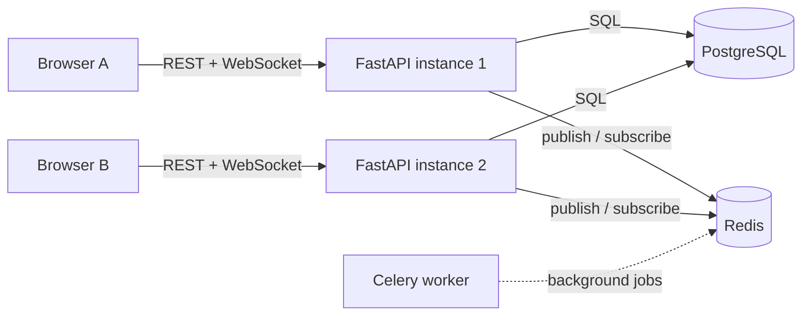
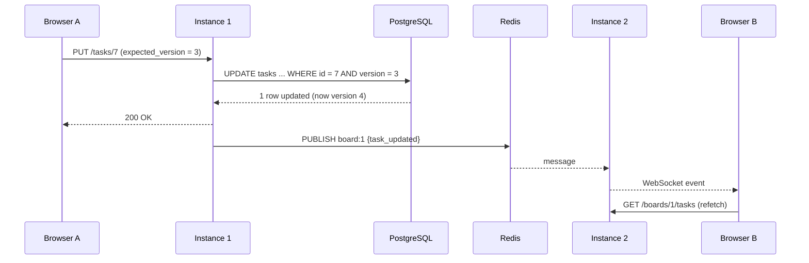

# Real-Time Collaborative TaskBoard

A Kanban board where several people edit the same board at once and every change appears on everyone's screen instantly, without refreshing.

It is a backend project first. The board is the vehicle; the point is solving the problems that show up as soon as more than one user and more than one server are involved:

- **Real-time sync across server instances.** Two users connected to different servers behind a load balancer still see each other's changes.
- **Concurrent writes.** When people edit the same task at the same moment, exactly one edit wins and the rest are told, instead of silently overwriting each other.
- **Access control.** Users only ever see and change boards they belong to, with owner, editor and viewer roles.
- **Failure recovery.** Dropped WebSockets and dropped Redis connections recover on their own, and clients refetch anything they missed.

**Measured:** with 1,000 live connections spread over 2 server instances, every edit reached every client (100,000 of 100,000 events), with a p95 of 58 ms from sending the edit to the last client receiving it. [Details below](#performance).

**Stack:** Python · FastAPI · PostgreSQL · SQLAlchemy · Alembic · Redis (Pub/Sub, rate limiting, caching, Celery broker) · WebSockets · JWT · Docker · GitHub Actions · vanilla JavaScript

---

## Architecture



Every server instance holds WebSocket connections only for its own clients. Redis Pub/Sub connects the instances: each board has a channel (`board:<id>`), every change is published to it, and every instance with viewers of that board is subscribed.

### How one change reaches every client



The event only says *what* changed; clients refetch the board. That keeps authorization in one place (the REST endpoints) and makes the client self-healing: any later event brings it fully up to date.

---

## Engineering decisions

### 1. Optimistic concurrency as an atomic compare-and-swap

Each task has a `version`. A client sends the version it last saw, and the server applies the write only if that is still the current version; otherwise it returns **409 Conflict**.

The check is part of the `UPDATE` itself, not done in Python:

```python
update(Task).where(Task.id == task_id, Task.version == expected_version)
            .values(**changes, version=Task.version + 1)
# 0 rows updated -> someone else won -> 409
```

A read-then-check-then-write version looks equivalent but has a race: concurrent requests all read the same version, all pass the check, and all write. Measured against 20 simultaneous writers holding the same version, that version let **17 of 20** through, silently losing 16 updates. The atomic version lets exactly **1** through. Postgres locks the row during the `UPDATE`, and a waiting writer re-checks the `WHERE` clause against the committed row, finds the version has moved on, and matches nothing.

[`tests/test_concurrency.py`](tests/test_concurrency.py) reproduces the race with 20 threads released at once through a barrier, using a pre-warmed connection pool so connection setup can't accidentally serialize them.

### 2. Cross-instance real-time with Redis Pub/Sub

- One Redis subscription per board **per instance**, started when the first local client opens the board and cancelled when the last one leaves.
- Broadcasting to local sockets is concurrent, and a dead socket is dropped instead of aborting delivery to everyone else.
- Events are published after the database commit, in a background task, so the HTTP response isn't delayed.

### 3. Surviving dropped connections

Redis Pub/Sub is at-most-once: messages published while a subscriber is disconnected are gone. Rather than pretend otherwise, the system recovers explicitly:

- **Server side:** if the Redis connection drops, the listener resubscribes with exponential backoff and then sends clients a `resync` event, so they refetch the board. Before this, a dropped connection killed the listener silently and that board stopped updating on that instance until everyone left. [`tests/test_realtime.py`](tests/test_realtime.py) kills the connection with `CLIENT KILL` and asserts recovery.
- **Client side:** a dropped WebSocket reconnects with exponential backoff and jitter (so clients don't all reconnect in the same instant after an outage), then refetches the board.
- **Close codes:** the server refuses sockets with application close codes: `4401` for a missing or expired token, `4403` for a non-member. The client can then tell "log in again" and "stop retrying" apart from a network drop.

### 4. Authorization: board membership and roles

| Role | Read board | Create / edit / move / delete | Invite, change roles, remove | Leave |
|---|---|---|---|---|
| owner | ✅ | ✅ | ✅ | ❌ a board always keeps its owner |
| editor | ✅ | ✅ | ❌ | ✅ |
| viewer | ✅ | ❌ 403 | ❌ | ✅ |

- Every REST route and the WebSocket check membership through shared dependencies in [`app/core/deps.py`](app/core/deps.py).
- Non-members get **404, not 403**, so board IDs can't be probed to learn which boards exist.
- A task can't be moved into a list on another board, even by someone who is a member of both.
- **Role changes apply immediately**, because roles are checked on every request. A `member_role_changed` event also updates open clients, so a demoted editor's board turns read-only without a refresh.
- **Removal revokes live connections too, on every instance.** Revoking REST access alone isn't enough: a removed user's already-open socket would keep receiving updates until they refreshed. So removal publishes a `member_removed` event, and every instance closes that user's sockets for the board (code `4403`) before delivering the event to anyone else.

### 5. Invite search that doesn't leak the user directory

`GET /users/search` powers username autocomplete:

- Case-insensitive prefix match, answered by a `lower(username) text_pattern_ops` index, so it stays an index range scan as the user table grows. A test checks the query plan.
- Returns usernames only, never emails. At most 8 results, and a per-user rate limit slows down scraping.
- LIKE wildcards in the query are escaped, so typing `%` doesn't match everyone.
- People you already work with rank first, with the boards you share: "On 2 of your boards: Batman, Sprint". This is a self-join on memberships restricted to the searcher's own boards, so it never reveals boards the searcher isn't on.

### 6. Smaller decisions

- **Rate limiting per user, not per IP.** Behind Render's proxy every request has the proxy's IP. The counter and its expiry are created in one atomic step (`SET NX EX` + `INCR` in a transaction), so a crash can't leave a counter that never expires.
- **No blocking the event loop.** SQLAlchemy is synchronous, so async routes and the WebSocket handshake run database work in the threadpool.
- **No N+1 queries.** Task creators are loaded with a join; a test asserts the query count doesn't grow with the number of tasks.
- **Schema drift test.** The test database is built by running the real migrations, then compared against the models, so a column that exists only in Python fails CI.
- **Migrations that inspect before changing.** They're safe to run on a database whose history doesn't exactly match the migration files.
- **`pool_pre_ping`**, because Neon suspends idle databases and silently kills pooled connections.
- **Health endpoint.** `GET /health` checks Postgres and Redis with timeouts and returns 503 if either is down, so the platform stops routing traffic to an instance that can't serve requests or deliver events. Failure details go to the logs, not to the unauthenticated response.

---

## Performance

[`scripts/loadtest.py`](scripts/loadtest.py) opens N WebSockets to one board, spread across two server instances, then makes 100 edits 100 ms apart, alternating instances. For every client it measures the time from sending the HTTP request to receiving the event. That covers the whole path: HTTP, Postgres commit, Redis publish, both instances' subscribers, and every socket.

| Connections | Events delivered | Write (PUT) p50 | Edit → client p50 | p95 | p99 |
|---|---|---|---|---|---|
| 100 | 10,000 / 10,000 | 20.3 ms | 23.0 ms | 25.5 ms | 26.7 ms |
| 250 | 25,000 / 25,000 | 20.1 ms | 26.6 ms | 31.9 ms | 33.2 ms |
| 500 | 50,000 / 50,000 | 19.8 ms | 33.0 ms | 41.5 ms | 44.0 ms |
| 1,000 | 100,000 / 100,000 | 20.0 ms | 42.3 ms | 58.0 ms | 60.9 ms |

**Reading it:** about 20 ms is the write itself, mostly Postgres round trips. Fan-out adds a few milliseconds at 100 connections and about 20 ms at 1,000 (roughly 500 sockets per instance). No events were lost at any size.

**Setup and caveats:** two uvicorn instances (one worker each) sharing PostgreSQL 15 and Redis 7 in Docker, with the load generator on the same machine (a 36-thread Xeon on Windows). All clients run in one Python process, and each instance's first requests are warmed up before timing. This measures the architecture's fan-out cost, not a production deployment.

```bash
python scripts/loadtest.py --targets http://localhost:8001,http://localhost:8002 --clients 500
```

---

## Known trade-offs and next steps

| Trade-off | Why it's acceptable now | Next step |
|---|---|---|
| Pub/Sub is at-most-once | Clients refetch on reconnect and on `resync` | Redis Streams, so clients can replay from their last event ID |
| Commit and publish are two separate writes | Losing an event is recovered by the next refetch | Transactional outbox |
| Every event triggers a full refetch by every viewer | Simple, and keeps authorization in one place | Send diffs in events, or cache the board snapshot |
| Fixed-window rate limit allows bursts at window edges | Good enough at this scale | Sliding window or token bucket |
| JWTs can't be revoked before they expire (30 min), and the WebSocket token travels in the URL | Short expiry limits the window | Refresh tokens and a short-lived WebSocket ticket |
| A removed member's socket closes when the `member_removed` event arrives, milliseconds after the commit | REST access ends at the commit; the window is tiny | Re-check membership before each delivery |

**Deliberately out of scope:** column reordering, password reset and real email delivery (the welcome email is a simulated Celery job), and an admin dashboard. They add features rather than depth.

---

## Running locally

Requires Docker.

```bash
docker compose up --build
```

Then open http://localhost:8000. The web container runs the migrations on startup. Interactive API docs are at http://localhost:8000/docs.

## Running the tests

The tests run against real PostgreSQL and Redis, not mocks.

```bash
docker compose up -d db redis
pip install -r requirements-dev.txt
pytest
```

They use a separate `taskboard_test` database (created automatically) and Redis database 15. As a safety net, the suite refuses to run against any database whose name doesn't end in `_test`. CI runs the same suite on every push ([`.github/workflows/ci.yml`](.github/workflows/ci.yml)).

---

## API overview

| Method | Path | Access |
|---|---|---|
| POST | `/auth/signup`, `/auth/login` | public |
| GET | `/auth/me` | logged in |
| GET, POST | `/boards/` | logged in (lists only your boards, with your role and member count) |
| GET | `/boards/{id}`, `/boards/{id}/lists`, `/boards/{id}/tasks`, `/boards/{id}/members` | member |
| POST | `/boards/{id}/members` | owner |
| PATCH | `/boards/{id}/members/{user_id}` | owner |
| DELETE | `/boards/{id}/members/{user_id}` | owner, or yourself to leave |
| POST, DELETE | `/lists/`, `/lists/{id}` | editor |
| POST, PUT, DELETE | `/tasks/`, `/tasks/{id}` | editor |
| GET | `/users/search?q=&board_id=` | logged in (owner when `board_id` is given) |
| WS | `/ws/boards/{id}?token=` | member |
| GET | `/health` | public |

## Project structure

```
app/
  core/         config, JWT, authorization dependencies, rate limiting
  db/           engine and session
  models/       SQLAlchemy models
  schemas/      Pydantic request and response models
  routers/      auth, boards, lists, tasks, users, websocket, health
  services/     optimistic concurrency, Redis publish/subscribe
  websockets/   per-instance connection manager
  worker/       Celery tasks
alembic/        migrations
scripts/        load test
frontend/       vanilla JS client
tests/          integration tests against real Postgres and Redis
```
